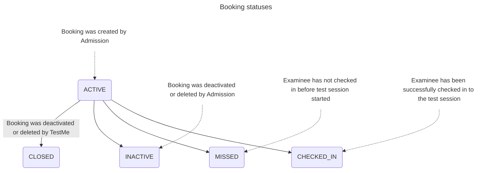

# AtlasValue

REST API that allows to manage atlases. 

## How to run:
- Pre-installation of Maven and jdk17 is required
- Clone the Git repository: `https://github.com/PavelBui/AtlasValue` (main branch)
- Run the command `mvn clean package` in the root folder
- Run the command `java -jar TaskTrackTemplate-1.0-SNAPSHOT.jar` in the `target` folder

## Parameters
- **Port** - 8081
- **URL** - http://localhost:8081
- **Swagger** - http://localhost:8081/swagger-ui/index.html

## Atlas endpoints
- **Create atlas** - POST request http://localhost:8081/atlas
    - `RequestBody: AtlasDto`
    - `ResponseBody: AtlasDto`
- **Get atlas** - GET request http://localhost:8081/atlas/{id}
    - `PathVariable: atlas id`
    - `ResponseBody: AtlasDto`
- **Get all atlases** - GET request http://localhost:8081/atlas
    - `ResponseBody: List of AtlasDto`
- **Update atlas** - PUT request http://localhost:8081/atlas/{id}
    - `PathVariable: atlas id`
    - `RequestBody: AtlasDto`
    - `ResponseBody: AtlasDto`
- **Delete atlas** - DELETE request http://localhost:8081/atlas/{id}
    - `PathVariable: atlas id`
    - `ResponseBody: String` (Atlas was deleted successfully)

## AtlasDto (example)
```json
{
    "id": 0,
    "title": "string",
    "time_period": "string",
    "description": "string",
    "class": "string",
    "year": "integer",
    "country": "string",
    "publisher": "string",
    "circulation": "integer"
}
```

## Test Mermaid

